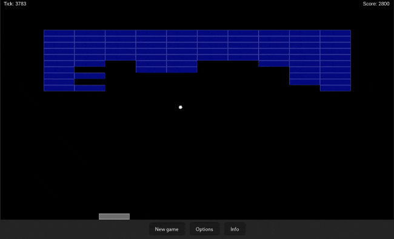

# Brick Breaker
A simple brick braker game written in TypeScript.

## Play the demo -> [here](https://brick-breacker.netlify.app/)

## How to play
- Use the left and right arrow keys to move the paddle
- Use the space bar to launch the ball
- Break all the bricks to win

## How to run
1. Clone the repository
2. Run `deno install` to install the dependencies
3. Run `deno run start` to start the game
